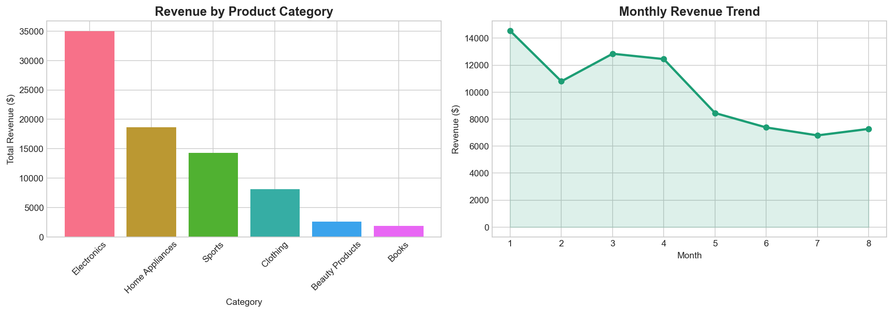
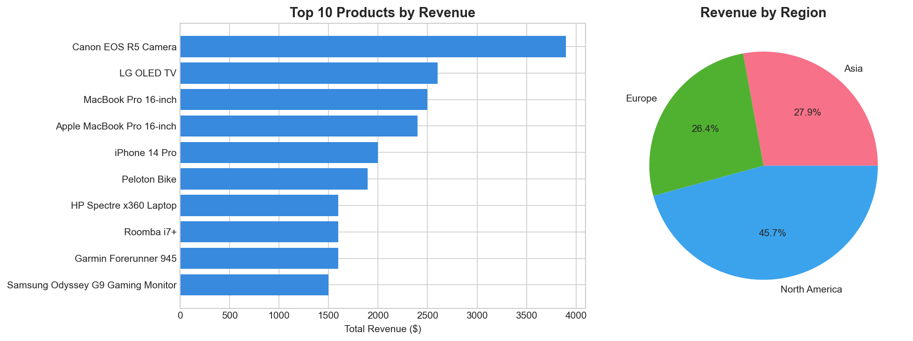
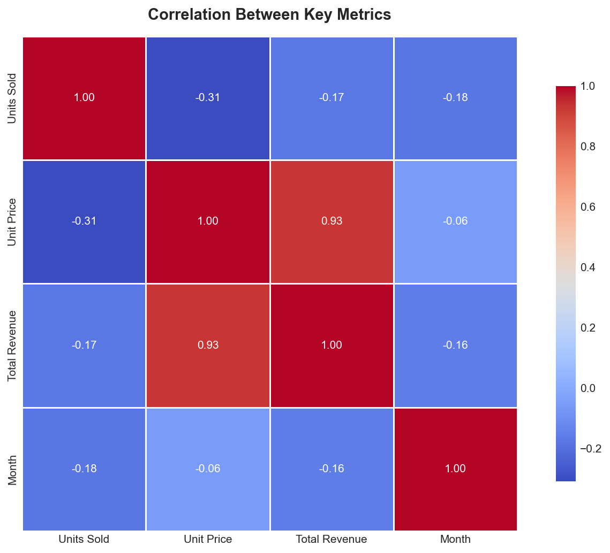
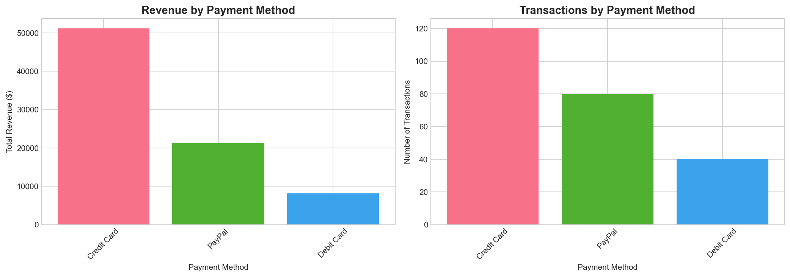
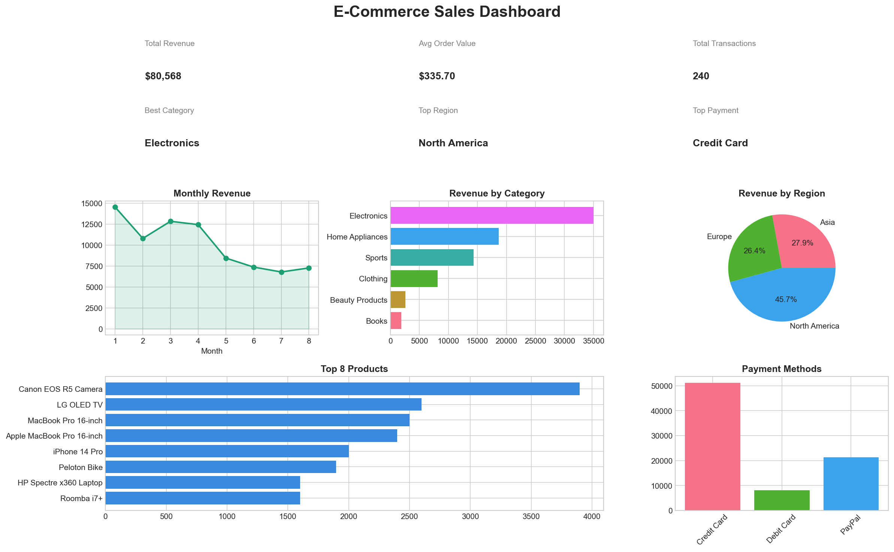

# E-Commerce Sales Analysis
> An end-to-end data analysis project uncovering revenue drivers and actionable business insights from 240 real transactions.

   

---

## The Business Problem

An e-commerce company has 12 months of sales data across multiple product categories, regions, and payment methods — but no clear picture of **what drives revenue**, **when to stock up**, or **where to focus marketing spend**.

This analysis answers 4 key business questions:
1. Which product categories generate the most revenue?
2. When is the peak sales period — and how should the business prepare?
3. Which regions offer the highest ROI for marketing investment?
4. What payment methods do customers prefer?

---

## Key Results

| Metric | Value |
|--------|-------|
| Total Revenue | **$80,568** |
| Average Order Value | **$335.70** |
| Total Transactions | **240** |
| Best Category | **Electronics** |
| Peak Month | **January** |
| Top Region | **North America** |
| Top Payment | **Credit Card** |

---

## Insights & Recommendations

### 1. Electronics dominates — but it's seasonal
Electronics is the highest-grossing category, with revenue peaking in **January**. This suggests post-holiday demand or New Year purchasing behavior.

**Recommendation:** Scale Electronics inventory and run targeted campaigns **before January** to maximize peak-season revenue.

### 2. North America is the highest-ROI market
North America generates the largest share of revenue across all regions.

**Recommendation:** Allocate the majority of the marketing budget to North America. Secondary regions should be monitored for growth potential.

### 3. Credit Card is the dominant payment method
Customers overwhelmingly prefer Credit Card payments over other methods.

**Recommendation:** Ensure a seamless Credit Card checkout experience. Consider offering Credit Card-exclusive promotions to boost conversion rates.

### 4. Revenue seasonality creates risk
Some months significantly underperform compared to January.

**Recommendation:** Introduce time-limited promotions and bundle deals during low-performing months to smooth revenue seasonality.

---

## Visualizations

### Revenue by Category & Monthly Trend


### Top 10 Products & Revenue by Region


### Correlation Between Key Metrics


### Payment Method Analysis


### Full KPI Dashboard


---

## Tech Stack

| Tool | Purpose |
|------|---------|
| Python 3.13 | Core language |
| Pandas | Data cleaning & analysis |
| Matplotlib | Data visualization |
| Seaborn | Statistical charts |
| Jupyter Notebook | Interactive development |

---

## Project Structure

```
ecommerce-analysis/
├── data/
│   └── Online Sales Data.csv
├── notebooks/
│   └── analysis.ipynb
├── outputs/
│   ├── revenue_analysis.png
│   ├── products_regions.png
│   ├── correlation_heatmap.png
│   ├── payment_analysis.png
│   └── dashboard.png
└── README.md
```

---

## How to Run

```bash
# Install dependencies
pip install pandas matplotlib seaborn jupyter

# Launch notebook
jupyter notebook
```

Open `notebooks/analysis.ipynb` and run all cells.

---

## About

This project was built as part of a data analysis portfolio to demonstrate end-to-end skills: data cleaning, exploratory analysis, visualization, and business storytelling.

**Open to freelance data analysis projects** — feel free to reach out!
